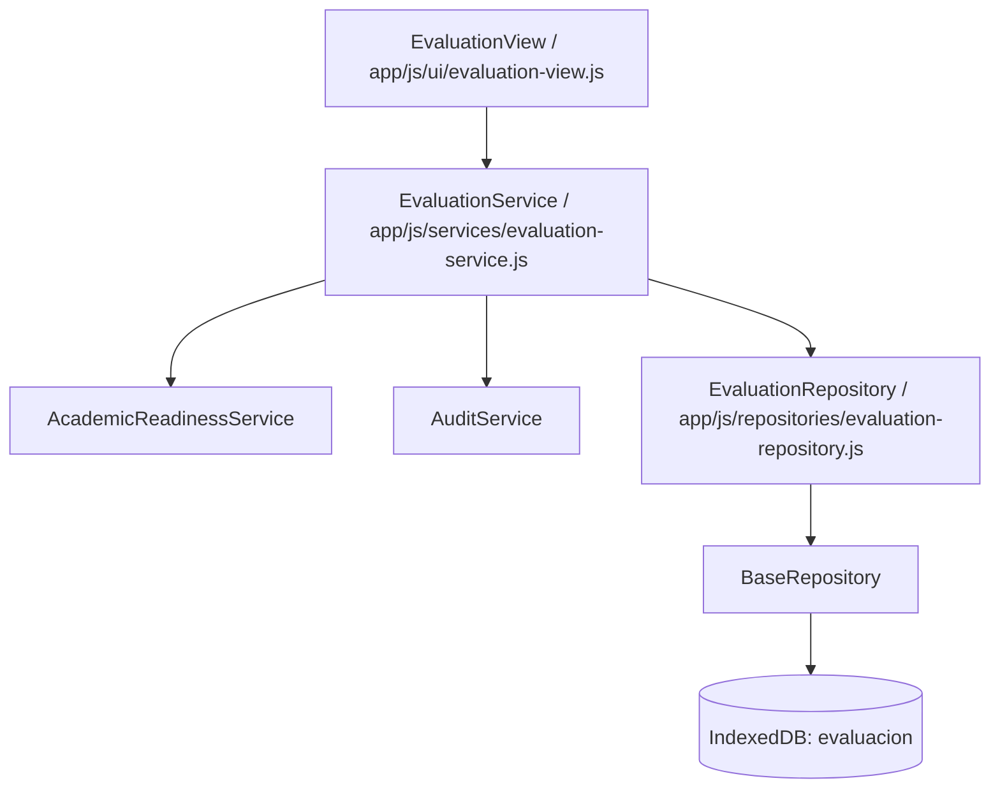

# Informe Técnico M07 — EVALUACIÓN

## 1. Arquitectura del Motor de Evaluación

El módulo de Evaluación M07 se ha diseñado e implementado respetando estrictamente la arquitectura de capas desacopladas del Sistema Académico CETPRO:



La capa UI (`EvaluationView`) **NUNCA** accede directamente a IndexedDB ni al `objectStore('evaluacion')`. Toda interacción pasa obligatoriamente por `EvaluationService` y `EvaluationRepository`.

---

## 2. Auditoría de Campos Contractuales (Entidad 13 — EVALUACION)

De acuerdo con `docs/contracts/DATA_CONTRACTS.md` (Entidad 13) y `docs/contracts/INDEXEDDB_SCHEMA.md` (Sección 2.13), los campos autorizados para la entidad Evaluación son:

| CAMPO | TIPO | OBLIGATORIO | ORIGEN | REGLA DE NEGOCIO / DESCRIPCIÓN |
|---|---|---|---|---|
| `id` | `string` | SÍ | Sistema (`EVAL-*`) | Clave primaria técnica única e inmutable (UUID / timestamp + aleatorio). |
| `batchId` | `string` | SÍ | Sistema / Transmisión | Identificador técnico de lote para garantizar **idempotencia operativa**. |
| `matriculaId` | `string` | SÍ | Matrícula (`MAT-*`) | Clave foránea a la matrícula del estudiante. Prohibido usar DNI o nombre. |
| `estudianteId` | `string` | NO | Estudiante (`EST-*`) | Clave foránea opcional de trazabilidad a la persona civil. |
| `unidadId` | `string` | SÍ | Unidad (`UNID-*`) | Unidad Didáctica a la que pertenece la evaluación. |
| `indicadorId` | `string` | SÍ | Indicador (`IND-*`) | Indicador de logro evaluado. |
| `nota` | `number` | SÍ | Entrada de Usuario | Valor en la escala vigesimal contractual (**0 a 20**). Enteros o flotantes. |
| `fecha` | `string` | SÍ | Formulario | Fecha de registro en formato ISO 8601 (`YYYY-MM-DD`). |
| `observacion` | `string` | NO | Entrada de Usuario | Observaciones o notas cualitativas del docente. |
| `estadoLogico` | `string` | SÍ | Sistema | `ACTIVO` o `ANULADO` (borrado lógico auditado). |
| `creadoEn` | `string` | SÍ | Sistema | Timestamp ISO de la creación del registro. |
| `actualizadoEn` | `string` | SÍ | Sistema | Timestamp ISO de la última actualización del registro. |

---

## 3. Idempotencia Operativa y Ausencia de Índice UNIQUE Académico

### 3.1 Identificador de Lote (`batchId`)
Para prevenir duplicación por doble clic, re-envíos de red o fallas de transmisión, cada operación de guardado masivo en lote utiliza un `batchId` único (ej. `BATCH-EVAL-20260912-XXXX`). Si una petición reenvía exactamente el mismo `batchId`, `EvaluationService` detecta la transmisión previa y devuelve los registros persistidos de forma idempotente sin duplicar filas en la base de datos.

### 3.2 Ausencia de Restricción UNIQUE en `(matriculaId + indicadorId)`
El esquema IndexedDB (`evaluacion`) define únicamente como clave primaria el `id` técnico (`EVAL-*`). **NO** existe un índice `unique: true` sobre `(matriculaId, indicadorId)`. Un nuevo lote con una identidad técnica diferente (`batchId` distinto) para el mismo `(matriculaId, indicadorId)` no queda bloqueado por IndexedDB ni por el repositorio. Esto preserva la flexibilidad técnica para soportar múltiples intentos, recuperaciones o evidencias cuando la Jefatura entregue la normativa oficial B-003.

### 3.3 Control de Duplicados dentro del Mismo Lote
Se valida y rechaza como error técnico de integridad (`IntegrityError`) si una misma `matriculaId` aparece más de una vez dentro del mismo lote de evaluación `evaluaciones[]`.

---

## 4. Desacoplamiento del Motor respecto a UD1–UD7

El **Motor de Evaluación** (`EvaluationService` y `EvaluationRepository`) es completamente desacoplado y genérico:
- Acepta **cualquier `unidadId` oficial o de prueba válida** configurada en la estructura curricular (probado y verificado en `CETPRO_M07_TEST_DB` con la unidad `UNID-TEST-008`).
- Las plantillas documentales de evaluación entregadas oficialmente por el CETPRO permanecen independientes sin invención de plantillas documentales adicionales.

---

## 5. Control de Prerrequisitos de Lectura/Escritura (Readiness)

`EvaluationService` ejecuta obligatoriamente en cada operación:
```javascript
const readiness = await this.readinessService.canRegisterEvaluation(matriculaId);
if (!readiness.ready) {
  throw new OperationalError('CONFIGURACIÓN ACADÉMICA PENDIENTE');
}
```
En la base productiva `CETPRO_DB`, dado que faltan Periodo Académico, Módulo por Grupo, Unidades Didácticas e Indicadores de Logro, `canRegisterEvaluation` retorna `ready = false`, garantizando que **EVALUACIÓN = 0** en producción.
